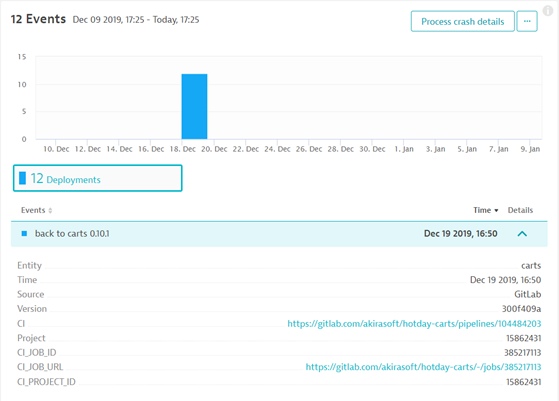

**Build Resiliency into your Continuous Delivery Pipeline​ with AI and Automation** workshop given @[Dynatrace Perform 2020](https://https://www.dynatrace.com/perform-vegas//)

In our previous exercise, we deployed the Carts service and corresponding DB to each of three Kubernetes namespaces. In this exercise, we will be adding a call to the Dynatrace Events API to add a deployment notification. Out of all the concepts we will be reviewing today this is one that everyone should include in their pipelines no matter what! By including deployment notifications in our pipelines Dynatrace's root-cause-analysis engine will include these events in determining the cause of a detected problem and provide an easy link back to the applicable pipeline run and then the commit that triggered that pipeline run!



# Exercise 3: Modify pipeline to automatically push deployment events to enhance DAVIS root cause analysis

## The Dynatrace Events API: /api/v1/events

Calls to the Dynatrace events API have several required elements:

Element | type | description
--- | --- | ---
eventType | string | The type of event, for deployments use "CUSTOM_DEPLOYMENT"
attachRules | json object | What Dynatrace entities to attach the event to
source | string | Label for source of the event, "GitLab" here
deploymentName | string | Name of the deployment, great place to use commit message
deploymentVersion | string | Version of the deployment, great place to use a build hash or tagged version
deploymentProject | string | not technically required but useful, here we'll be linking to GitLab ProjectID
customProperties | json object | also not technically required but useful, here we'll build out an object containing links back to GitLab and other useful info
ciBackLink | string | again, not required but useful, here we'll include a link taking us to the pipeline view in GitLab

### attachRules details

The *attachRules* object consists of several elements. It can contain one or more *tagRule* objects. Each tagRule must contain a value for *meTypes* (in this case we are looking for SERVICES) and the tags array. During environment setup we used the Dynatrace configuration API to create a tag rule creating the "hotday-tag-rule" tag with a value matching the application name and Kubernetes namespace. From the events API perspective this is a CONTEXTLESS tag, with the key of "hotday-tag-rule" and then we will utilize GitLab parameters to populate the key's value. 

```json
    "attachRules": {
      "tagRule" : {
          "meTypes" : "SERVICE",
          "tags" : [ 
            {
              "context": "CONTEXTLESS",
              "key": "hotday-tag-rule", 
              "value": "${APPLICATION_SHORT_NAME}-${CI_ENVIRONMENT_NAME}"
            }
          ]
    }
```

### customProperties details

The customProperties object is made up of key:value pairs. Dynatrace will turn URLs into hyperlinks. So here we'll make use of GitLab PIpeline built-in variables to provide a link to the invidual Job run (useful to view job logs), the ID of the Job, ID of the Project and the git commit hash.

```json
    "customProperties":{
      "CI_JOB_URL": "${CI_JOB_URL}",
      "CI_JOB_ID": "${CI_JOB_ID}",
      "CI_PROJECT_ID": "${CI_PROJECT_ID}",
      "Commit": "${GIT_COMMIT}"
    }
```

### Complete Dynatrace Event post body
```json
{
    "eventType": "CUSTOM_DEPLOYMENT",
    "attachRules": {
      "tagRule" : {
          "meTypes" : "SERVICE",
          "tags" : [ 
            {
              "context": "CONTEXTLESS",
              "key": "hotday-tag-rule", 
              "value": "${APPLICATION_SHORT_NAME}-${CI_ENVIRONMENT_NAME}"
            }
          ]
      }
    },
    "deploymentName":"${CI_COMMIT_MESSAGE}",
    "deploymentVersion":"${CI_COMMIT_SHORT_SHA}",
    "deploymentProject":"${CI_PROJECT_ID}",
    "ciBackLink":"${CI_PIPELINE_URL}",
    "source":"GitLab",
    "customProperties":{
      "CI_JOB_URL": "${CI_JOB_URL}",
      "CI_JOB_ID": "${CI_JOB_ID}",
      "CI_PROJECT_ID": "${CI_PROJECT_ID}",
      "Commit": "${GIT_COMMIT}"
    }
  }
```

Read more about the Dynatrace events API [here](https://www.dynatrace.com/support/help/extend-dynatrace/dynatrace-api/environment-api/events/).


### Pulling it all together:

For this job, we're using a simple Docker container created for use by our pipeline today (see the Dockerfile [here](https://github.com/akirasoft/keptn-k8s-runner/blob/master/Dockerfile)). The script our job executes takes advantage of the Dynatrace credentials we stored as a Kubernetes secret during environment creation to populate environment variables avoiding needing to provide those credentials to GitLab. The POST payload is stored to an environment variable (**VERY IMPORTANT:** note the escaped quotes) and then to a file. Curl is then used to post the deployment event to the Dynatrace API.

```yaml
dt_test_deployment_event:
  stage: deploy-test
  image: docker.io/mvilliger/keptn-k8s-runner:0.6.2
  environment:
    name: carts-test
  variables:
      GIT_STRATEGY: none
  script: |
    echo ${kube_config} | base64 -d > ${kubeconf_file}
    export KUBECONFIG=${kubeconf_file}
    echo ${kube_config} | base64 -d > ${KUBECONFIG}
    export KUBECONFIG=$KUBECONFIG
    DT_TENANT_URL=$(kubectl -n keptn get secret dynatrace-credentials-gitlab -ojsonpath={.data.dynatrace-credentials} | base64 -d | yq r - -d '*' DT_TENANT | cut -c 3-)
    DT_API_TOKEN=$(kubectl -n keptn get secret dynatrace-credentials-gitlab -ojsonpath={.data.dynatrace-credentials} | base64 -d | yq r - -d '*' DT_API_TOKEN | cut -c 3-)
    echo ${APPLICATION_SHORT_NAME}-${CI_ENVIRONMENT_NAME}
    echo ${CI_COMMIT_SHORT_SHA}
    export DT_PAYLOAD="
    {
      \"eventType\": \"CUSTOM_DEPLOYMENT\",
      \"attachRules\": {
        \"tagRule\" : {
            \"meTypes\" : \"SERVICE\",
            \"tags\" : [ 
              {
                \"context\": \"CONTEXTLESS\",
                \"key\": \"hotday-tag-rule\", 
                \"value\": \"${APPLICATION_SHORT_NAME}-${CI_ENVIRONMENT_NAME}\"
              }
            ]
        }
      },
      \"deploymentName\":\"${CI_COMMIT_MESSAGE}\",
      \"deploymentVersion\":\"${CI_COMMIT_SHORT_SHA}\",
      \"deploymentProject\":\"${CI_PROJECT_ID}\",
      \"ciBackLink\":\"${CI_PIPELINE_URL}\",
      \"source\":\"GitLab\",
      \"customProperties\":{
        \"CI_JOB_URL\": \"${CI_JOB_URL}\",
        \"CI_JOB_ID\": \"${CI_JOB_ID}\",
        \"CI_PROJECT_ID\": \"${CI_PROJECT_ID}\",
        \"Commit\": \"${GIT_COMMIT}\"
      }
    }
    "
    echo $DT_PAYLOAD > payload.tmp
    curl -L -H "Authorization: Api-Token ${DT_API_TOKEN}" -H "Content-Type: application/json" "https://${DT_TENANT_URL}/api/v1/events" -d @payload.tmp
      
```

# Deploy the pipeline including deployment events

Please paste the following commands into your shell to make the pipeline change, commit it and push it via the git cli:

```console
cd /usr/keptn/hotday-carts
cp .gitlab-ci-withevents.yml .gitlab-ci.yml
git add .gitlab-ci.yml
git commit -m "include Deployment events"
git push origin master
```
