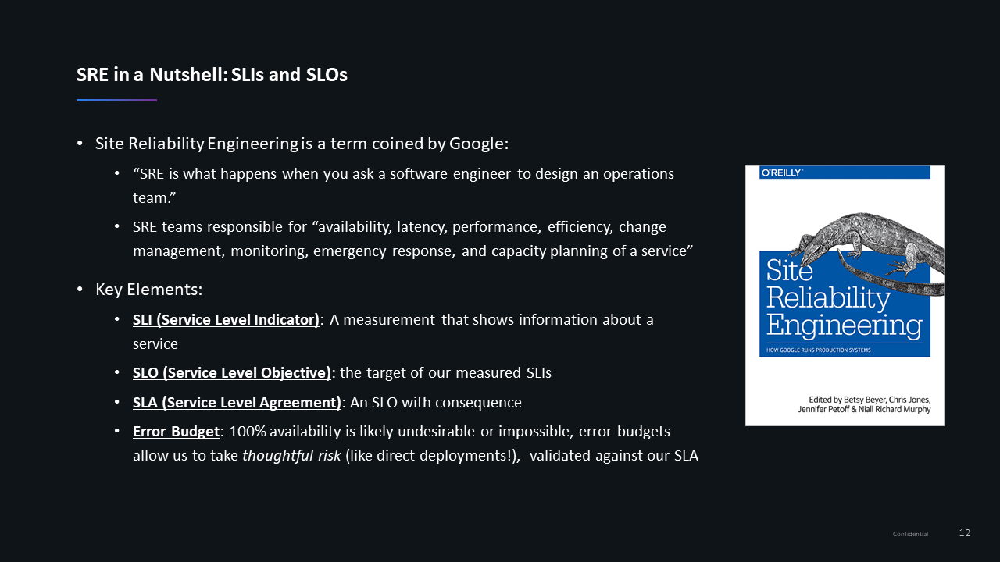

**Build Resiliency into your Continuous Delivery Pipeline​ with AI and Automation** workshop given @[Dynatrace Perform 2020](https://https://www.dynatrace.com/perform-vegas//)

In our previous exercise, we added a job to query Dynatrace for open problems. In this exercise, we will be adding [Keptn Quality Gates](https://keptn.sh/docs/0.6.0/usecases/deployments-with-quality-gates/) to our pipeline. 

# Exercise 6: Keptn Quality Gates recap and implementation within the pipeline

The brief presentation given before this exercise explained how we utilize Keptn Quality Gates to implement SRE principles within our pipelines. 



## Keptn onboarding for our Gitlab pipeline and carts service

To utilize Keptn to evaluate our SLIs against configured SLOs we must first create a project and onboard our carts service to that project. Since Keptn is only evaluating results for the hardening stage we have a very simple shipyard file containing only the hardening stage.

```yaml
stages:
  - name: "hardening"
```

1. Onboard Keptn project called `gitlab`:
    ```console
    cd /usr/keptn/hotday-carts
    keptn create project gitlab --shipyard=./shipyard-standalone.yaml
    ```

1. Onboard Carts service to the `gitlab` Keptn project:
    ```console
    cd /usr/keptn/hotday-carts
    keptn create service carts --project=gitlab
    ```

## Deploy the Dynatrace SLI service

Keptn Quality Gates utilizes an SLI provider to handle communications with a metric source based on the queries that are supplied in our SLI definition yaml. 

1. Deploy the Dynatrace SLI Service

    ```console
    kubectl apply -f https://raw.githubusercontent.com/keptn-contrib/dynatrace-sli-service/0.3.0/deploy/service.yaml 
    ```

1. Configure Keptn to utilize Dynatrace as the SLI provider for the gitlab project:

    ```console
    cd /usr/keptn/scripts
    ./enableDynatraceSLIforProject.sh gitlab
    ```

## Defining SLIs and SLOs

We must provide SLI and SLO definitions for Keptn to evaluate. To recap, SLIs represent the metrics we are seeking to validate and SLOs represent the value of this metrics against which an evaluation will occur.

The initial SLIs we will be using will be simple metrics corresponding to throughput, error rates and response times for the carts service in the hardening namespace of our cluster.

```yaml
---
  spec_version: '1.0'
  indicators:
    throughput: "builtin:service.requestCount.total:merge(0):count?scope=tag(hotday-tag-rule:$SERVICE-$SERVICE-$STAGE)"
    error_rate: "builtin:service.errors.total.count:merge(0):avg?scope=tag(hotday-tag-rule:$SERVICE-$SERVICE-$STAGE)"
    response_time_p50: "builtin:service.response.time:merge(0):percentile(50)?scope=tag(hotday-tag-rule:$SERVICE-$SERVICE-$STAGE)"
    response_time_p90: "builtin:service.response.time:merge(0):percentile(90)?scope=tag(hotday-tag-rule:$SERVICE-$SERVICE-$STAGE)"
    response_time_p95: "builtin:service.response.time:merge(0):percentile(95)?scope=tag(hotday-tag-rule:$SERVICE-$SERVICE-$STAGE)"
```

Our SLOs provide the targets for our metrics. Here we're looking for a response time that is no more than 20% slower than our previous releases and below 600ms both of these criteria must be met for our release to pass. Additionally, the response time must be less than 800ms or else a warning will be issued. The other metrics are provided for informational purposes only and will not be evaluated.

```yaml
---
spec_version: '0.1.1'
comparison:
  compare_with: "single_result"
  include_result_with_score: "pass"
  aggregate_function: avg
objectives:
  - sli: response_time_p95
    pass:             # pass if (relative change <= 10% AND absolute value is < 600ms)
      - criteria:
          - "<=+20%"  # relative values require a prefixed sign (plus or minus)
          - "<600"    # absolute values only require a logical operator
    warning:          # if the response time is below 800ms, the result should be a warning
      - criteria:
          - "<=800"
  - sli: throughput
  - sli: error_rate
  - sli: response_time_p50
  - sli: response_time_p90          
total_score:
  pass: "90%"
  warning: "75%"    
```

To utilize these values, we must add them to Keptn and our cluster so that they can be evaluated:

1. Add initial [Service Level Objectives](https://github.com/keptn/spec/blob/0.1.2/sre.md) for Keptn to evaluate:
    ```console
    cd /usr/keptn/hotday-carts
    keptn add-resource --project=gitlab --service=carts --stage=hardening --resource=slo_quality-gates.yaml --resourceUri=slo.yaml
    ```
1. Our pipeline will handle defining and updating our SLIs

## Implementing Keptn Quality Gates in a GitLab Pipeline:

To include Keptn Quality Gates in our pipeline we have to add two jobs.

1. Job to update our SLI definition

    In Keptn 0.6 our SLI definition is stored as yaml in our repo. In this job, we are searching for a placeholder that will be replaced with the CI_COMMIT_SHA of our build. This allows us to use calculated service metrics later in this exercise. We then push this updated SLI Definition to Keptn.

    ```yaml
    keptn-SLI-update:
    image: docker.io/mvilliger/keptn-k8s-runner:0.6.2
    stage: keptn-sli-update
    environment:
        name: carts-hardening
    variables:
        GIT_STRATEGY: fetch
    script: |
        echo ${kube_config} | base64 -d > ${kubeconf_file}
        export KUBECONFIG=${kubeconf_file}
        echo ${kube_config} | base64 -d > ${KUBECONFIG}
        export KUBECONFIG=$KUBECONFIG
        KEPTN_ENDPOINT=https://api.keptn.$(kubectl get cm keptn-domain -n keptn -ojsonpath={.data.app_domain})
        KEPTN_API_TOKEN=$(kubectl get secret keptn-api-token -n keptn -ojsonpath={.data.keptn-api-token} | base64 -d)
        keptn auth -a $KEPTN_API_TOKEN -e $KEPTN_ENDPOINT    
        sed -i 's/REPLACEME/'"${CI_COMMIT_SHA}"'/g' sli-quality-gates-dynatrace-extended.yaml
        cat sli-quality-gates-dynatrace-extended.yaml
        keptn add-resource --project=gitlab --stage=hardening --service=carts --resource=sli-quality-gates-dynatrace-extended.yaml --resourceUri=dynatrace/sli.yaml
    ```

1. Job to execute the Keptn Evaluation

    This job utilizes the Keptn cli to execute a "start-evaluation" command. As this command is asynchronous, we must capture the keptnContext that is returned via the CLI and utilize this keptnContext to continually query the Keptn API until the evaluation is complete. We then use jq to capture the evaluation results and pass the job if the Keptn evaluation was successful or fail the job if the Keptn evaluation failed. While Keptn has a built-in capability to wait 60 seconds for results processing by Dynatrace this job includes an additional 60-second wait. 

    ```yaml
    keptn-evaluation:
    image: docker.io/mvilliger/keptn-k8s-runner:0.6.2
    stage: keptn-eval-hardening
    environment:
        name: carts-hardening
    variables:
        GIT_STRATEGY: fetch
    script: |
        echo ${kube_config} | base64 -d > ${kubeconf_file}
        export KUBECONFIG=${kubeconf_file}
        echo ${kube_config} | base64 -d > ${KUBECONFIG}
        export KUBECONFIG=$KUBECONFIG
        export DOMAIN=$(kubectl get cm -n keptn keptn-domain -ojsonpath={.data.app_domain})
        KEPTN_ENDPOINT=https://api.keptn.$(kubectl get cm keptn-domain -n keptn -ojsonpath={.data.app_domain})
        KEPTN_API_TOKEN=$(kubectl get secret keptn-api-token -n keptn -ojsonpath={.data.keptn-api-token} | base64 -d)
        keptn auth -a $KEPTN_API_TOKEN -e $KEPTN_ENDPOINT
        
        # Start evaluation
        ctxid=$(keptn send event start-evaluation --project=gitlab --service=${APPLICATION_SHORT_NAME} --stage=hardening --timeframe=10m|tee tk|grep "context:"|awk {'print $5'})
        cat tk
        
        fin="0"
        until [ "$fin" = "1" ]
        do
            status=$(curl -s -k -X GET "${KEPTN_ENDPOINT}/v1/event?keptnContext=${ctxid}&type=sh.keptn.events.evaluation-done" -H "accept: application/json" -H "x-token: ${KEPTN_API_TOKEN}"|jq .data.evaluationdetails.result)
            if [ "$status" = "null" ]; then
                echo "Status null will wait..."
                sleep 5
            else
                fin="1"
            fi
        done
        echo "eval status = ${status}"
        if [ "$status" = "\"fail\"" ]; then
                echo "Keptn Quality Gate - Evaluation failed!"
                echo "For details visit the Bridge!"
                exit 1
        else
                echo "Keptn Quality Gate - Evaluation Succeeded"
        fi
    when: delayed
    start_in: 60 seconds
    ```

## Dynatrace Calculated Service Metrics

Dynatrace calculated service metrics will allow us to adjust our SLOs and SLIs to include queries specifically targetting the requests submitted by JMeter during the load test. This allows us to obtain more accurate results for our SLI queries and target specific calculated measures like DB calls per request, Calls to other services by our service, and the response time of just the requests in our load test.

These calculated service metrics can be easily incorporated into our SLI file (note the rt_invoke_avg, count_svccalls_invoke, and count_dbcalls_invoke):

```yaml
---
  spec_version: '1.0'
  indicators:
    throughput: "builtin:service.requestCount.total:merge(0):count?scope=tag(hotday-tag-rule:$SERVICE-$SERVICE-$STAGE)"
    error_rate: "builtin:service.errors.total.count:merge(0):avg?scope=tag(hotday-tag-rule:$SERVICE-$SERVICE-$STAGE)"
    response_time_p50: "builtin:service.response.time:merge(0):percentile(50)?scope=tag(hotday-tag-rule:$SERVICE-$SERVICE-$STAGE)"
    response_time_p90: "builtin:service.response.time:merge(0):percentile(90)?scope=tag(hotday-tag-rule:$SERVICE-$SERVICE-$STAGE)"
    response_time_p95: "builtin:service.response.time:merge(0):percentile(95)?scope=tag(hotday-tag-rule:$SERVICE-$SERVICE-$STAGE)"
    rt_invoke_avg: "calc:service.toptestresponsetime:filter(eq(LoadTestName,PerfCheck_REPLACEME)):merge(0):avg?scope=tag(hotday-tag-rule:$SERVICE-$SERVICE-$STAGE)"
    count_svccalls_invoke: "calc:service.toptestservicecalls:filter(eq(LoadTestName,PerfCheck_REPLACEME)):merge(0):sum?scope=tag(hotday-tag-rule:$SERVICE-$SERVICE-$STAGE)"
    count_dbcalls_invoke: "calc:service.toptestdbcalls:filter(eq(LoadTestName,PerfCheck_REPLACEME)):merge(0):sum?scope=tag(hotday-tag-rule:$SERVICE-$SERVICE-$STAGE)"    
```    

## Create and implement Dynatrace calculated service metrics in our pipeline

1. Create calculated metrics for use by our Quality Gates:
    ```console
    cd /usr/keptn/hotday-carts/scripts
    ./create-calculated-metrics.sh CONTEXTLESS hotday-tag-rule carts-carts-hardening
    ```

1. Add Service Level Objectives that include calculated service metrics for Keptn to evaluate (remember, the SLI will be automatically edited and uploaded by our pipeline):
    ```console
    cd /usr/keptn/hotday-carts
    keptn add-resource --project=gitlab --service=carts --stage=hardening --resource=slo_quality-gates-extended.yaml --resourceUri=slo.yaml
    ```

1. Make the Changes to our pipeline 

    Adjust pipeline to include Keptn Quality Gates:
    ```console
    cd /usr/keptn/hotday-carts
    cp gitlab-ci-full.yml .gitlab-ci.yml
    git add .gitlab-ci.yml
    git commit -m "include quality gates"
    git push origin master
    ```

1. Adjust the helm chart to deploy 

    file contents:

    ```yaml
    image: docker.io/keptnexamples/carts:0.10.2
    replicaCount: 1
    domain: REPLACEME
    ```

    Suggested commands to make change (can also be done directly in browser against GitLab repo):

    ```console
    cd /usr/keptn/hotday-carts/
    vi ./charts/carts/values.yaml
    git add ./charts/carts/values.yaml
    git commit -m "deploy slow carts"
    git push origin master
    ```

    ```yaml
    image: docker.io/keptnexamples/carts:0.10.2
    replicaCount: 1
    domain: REPLACEME
    ```

1. This build should fail Keptn evaluation and **NOT** be deployed to Production