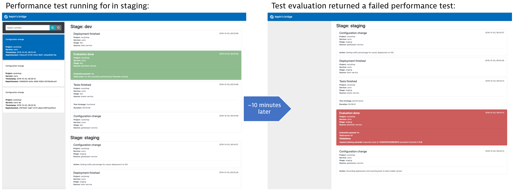

**Build Resiliency into your Continuous Delivery Pipeline​ with AI and Automation** workshop given @[Dynatrace Perform 2020](https://https://www.dynatrace.com/perform-vegas//)

In our previous exercises, we were configuring GitLab to handle our pipeline. Now we will be replacing GitLab pipelines with a deployment fully managed by Keptn. Rather than utilize complex scripting within our pipeline Keptn will manage all that for us.

# Exercise 7: Keptn Quality Gates recap and implementation within pipeline

## Create project

```yaml
stages:
  - name: "dev"
    deployment_strategy: "direct"
    test_strategy: "functional"
  - name: "staging"
    deployment_strategy: "blue_green_service"
    test_strategy: "performance"
  - name: "production"
    deployment_strategy: "blue_green_service"
    remediation_strategy: "automated"
```

```console
cd /usr/keptn/onboarding-carts
keptn create project sockshop --shipyard=./shipyard-keptn.yaml
```

## Onboard Carts service

```console
cd /usr/keptn/onboarding-carts
keptn onboard service carts --project=sockshop --chart=./carts
```

## Add simple functional and load tests for Carts service

```console
cd /usr/keptn/onboarding-carts
keptn add-resource --project=sockshop --stage=dev --service=carts --resource=jmeter/basiccheck.jmx --resourceUri=jmeter/basiccheck.jmx
keptn add-resource --project=sockshop --stage=staging --service=carts --resource=jmeter/load.jmx --resourceUri=jmeter/load.jmx
```

## Onboard Carts-DB service

```console
cd /usr/keptn/onboarding-carts
keptn onboard service carts-db --project=sockshop --chart=./carts-db --deployment-strategy=direct
```

# Trigger first deployment

## Deploy carts-db

```console
keptn send event new-artifact --project=sockshop --service=carts-db --image=mongo:4.2.2
```

## Deploy carts

```console
keptn send event new-artifact --project=sockshop --service=carts --image=docker.io/keptnexamples/carts --tag=0.10.1
```

## Watch deployment via Keptn's bridge

We exposed the bridge in our initial environment setup. If you no longer have the Keptn's Bridge up in a browser window you can quickly retrieve the URL:

```console
echo "Bridge URL: https://bridge.keptn.$(kubectl get cm keptn-domain -n keptn -ojsonpath={.data.app_domain})"
```

# Deploying with Quality Gates

## Configure SLO for Carts

```console
cd /usr/keptn/onboarding-carts
keptn add-resource --project=sockshop --stage=staging --service=carts --resource=slo-quality-gates.yaml --resourceUri=slo.yaml
```

## Configure SLI provider for sockshop project

The SLI provider configuration we uploader earlier was specifically for the gitlab project. We now need to configure the SLI provider for the sockshop project:

```console
cd /usr/keptn/onboarding-carts
kubectl apply -f lighthouse-source-dynatrace.yaml
```

## Configure SLIs for Carts

```console
cd /usr/keptn/onboarding-carts
keptn add-resource --project=sockshop --stage=staging --service=carts --resource=sli-config-dynatrace.yaml --resourceUri=dynatrace/sli.yaml
```

# Full deployment in action, with Quality Gates

## Deploy slow carts

```console
keptn send event new-artifact --project=sockshop --service=carts --image=docker.io/keptnexamples/carts --tag=0.10.2
```

As before, we can watch the deployment via the Bridge. Our quality gate should detect that this version of carts has a performance degredation and not deploy to production.



## Deploy the regular performant carts

```console
keptn send event new-artifact --project=sockshop --service=carts --image=docker.io/keptnexamples/carts --tag=0.10.3
```