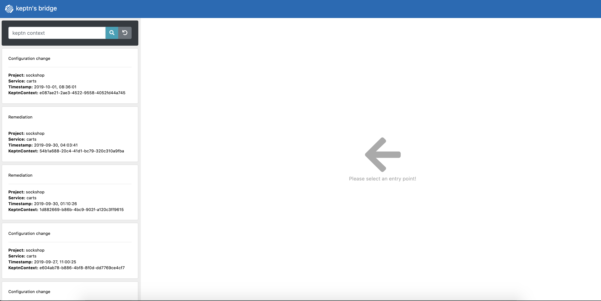
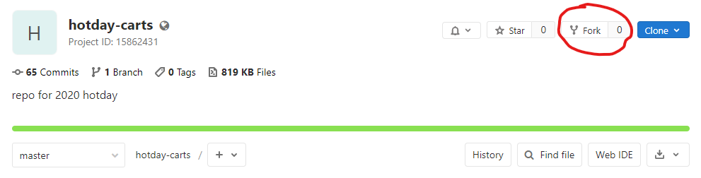
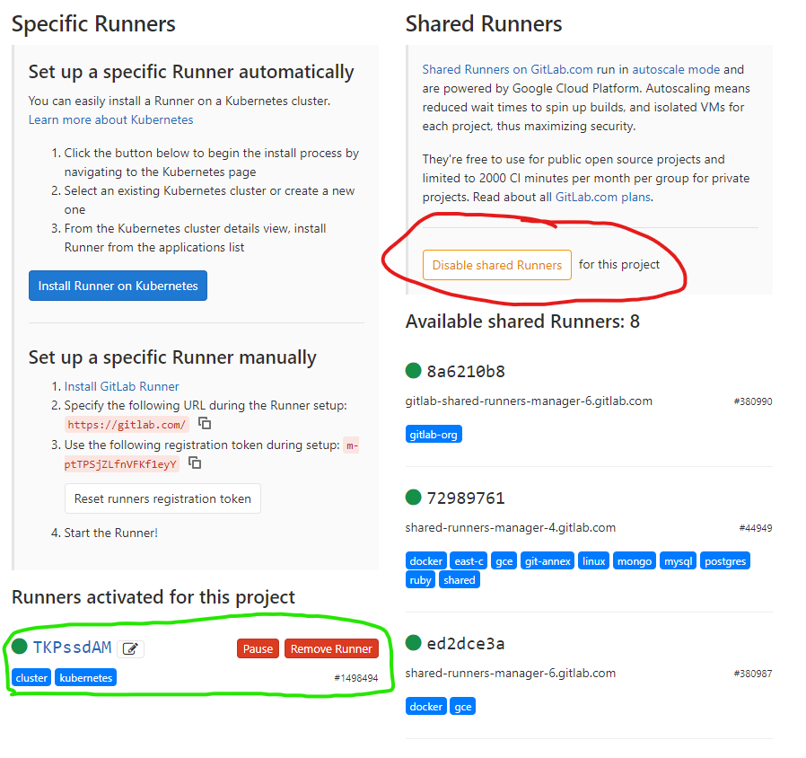

**Build Resiliency into your Continuous Delivery Pipeline​ with AI and Automation** workshop given @[Dynatrace Perform 2020](https://https://www.dynatrace.com/perform-vegas//)

# Overview
During this HOTday, you will get hands-on experience integrating [Keptn Quality Gates](https://keptn.sh) into [Gitlab](https://docs.gitlab.com/ee/ci/pipelines.html) CI/CD pipelines. 

# Pre-requisites

## 1. Accounts

* **Dynatrace** - A Dynatrace environment has been created for every attendee. Each attendee should have a card placed on the table in front of them containing the login information.
* **Gitlab trial account** - The HOT day's pipelines will be created using the pipeline features of Gitlab's SaaS offering. If you have not already done so please sign-up for a [Gitlab trial account](https://about.gitlab.com/free-trial/).

## 2. Tools

In this workshop, we will utilize a bastion host to run Docker containers that will have all the required tools installed. For ease of use each attendee will utilize the same login and password as utilized for the Dynatrace environment. 

* **Option A: Web based SSH** - Web based ssh access to the bastion host is provided by shell-in-a-box. 
1. To access Shell-in-a-box on the bastion host, just go to [bastion host](https://bastionplaceholder.com) in your browser as shown below:
    <details><summary>Access Shell-in-a-box</summary>
    
    </details>

* **Option B: directly via SSH** - 
1. For those that have a local ssh client and firewall rules that allow outbound access an outbound connection to the bastion host can be created like so:
    <details><summary>local ssh client access</summary>

    ```console
    ssh suppliedusername@bastionplaceholder.com
    ```
    
    </details>

1. To start and access the docker container you will use for this workshop, please execute, replacing {yourusername} with the username from your card:

    ```console
    docker run -d --name {yourusername} -it mvilliger/2020-hotday-keptn-qualitygates:0.1
    ```

1. If for some reason you lose access to the container, execute the following to access the container again:

    ```console    
    docker exec -it {yourusername} /bin/bash
    ```

# Exercise One: Environment Setup

## 1) Collect environment tokens

1. Now, it's time to set up your workshop environment. During the setup, you will need the following values from Dynatrace. We recommend copying the following lines into an editor, fill them out and keep them as a reference for later:

    ```
    Dynatrace Host Name (e.g. abc12345.live.dynatrace.com):
    Dynatrace API Token:
    Dynatrace PaaS Token:
    ```

1. To retrieve the API and PaaS Token, login to your Dynatrace tenant and navigate in the left-hand menu to **Settings -> Integration -> Dyantrace API** and click on **Generate token**. Provide a name, e.g., **keptn-token** and make sure to create a token with the following permissions:
    <details><summary>Open for permissions</summary>
    
    - Access problem and event feed, metrics and topology
    - Access logs
    - Configure maintenance windows
    - Read configuration
    - Write configuration
    - Capture request data
    - Real user monitoring JavaScript tag management
    </details>

    Copy the value of the token into your temporary file.

1. Retrieve the PaaS Token by navigating to **Settings -> Integration ->Platform as a Service** and generate a new token again with a name of your choice, e.g., **keptn-token**. Copy the value to your temporary file to keep it as a reference for later.


## 2) Install Keptn

Once you are logged onto the bastion host and shelled in to the container we are ready to install Keptn.

Install the Keptn control plane components into your cluster, using the **Keptn CLI**:

```console
cd /usr/keptn/scripts
keptn install --platform=kubernetes
```

The install will take about **5 minutes** to perform.

<details><summary>Details about this step</summary>

The Keptn CLI will now install all Keptn core components into your cluster, as well authenticating the Keptn CLI at the end of the installation. 

Once the installation is finished you should find a couple of pods running in your keptn namespace.

```console
$ kubectl get pods -n keptn

NAME                                                              READY   STATUS    RESTARTS   AGE
api-f7689c9d8-dj7vj                                               1/1     Running   0          2m3s
bridge-fd68b4c67-rf5dw                                            1/1     Running   0          2m3s
configuration-service-6d69f8c547-lm46q                            1/1     Running   0          2m2s
eventbroker-go-b65b9bb68-cm8c4                                    1/1     Running   0          2m3s
gatekeeper-service-665447b98b-dtmtb                               1/1     Running   0          2m3s
gatekeeper-service-evaluation-done-distributor-55cbcb5844-zpkn4   1/1     Running   0          2m1s
helm-service-5f65468cf6-2rbgt                                     1/1     Running   0          2m3s
helm-service-configuration-change-distributor-cfd57c9d9-hrq9c     1/1     Running   0          2m2s
helm-service-service-create-distributor-7bbdd68969-jwtjt          1/1     Running   0          2m2s
jmeter-service-84479f4bfd-qmfqz                                   1/1     Running   0          2m3s
jmeter-service-deployment-distributor-864bf9f745-9v2hb            1/1     Running   0          2m2s
keptn-nats-cluster-1                                              1/1     Running   0          2m31s
nats-operator-7dcd546854-mftl9                                    1/1     Running   0          2m49s
pitometer-service-6fd6c4bd9b-8vccf                                1/1     Running   0          2m3s
pitometer-service-tests-finished-distributor-5697bbd859-r48g7     1/1     Running   0          2m2s
prometheus-service-8676b7588f-j8pzj                               1/1     Running   0          53s
prometheus-service-monitoring-configure-distributor-7788487749d   1/1     Running   0          38s
remediation-service-5b486d69c-ljmfq                               1/1     Running   0          2m2s
remediation-service-problem-distributor-6d88b7d65c-8jwsm          1/1     Running   0          2m1s
servicenow-service-7cd9b8784-mrx7d                                1/1     Running   0          54s
servicenow-service-problem-distributor-7fccc4986-w9qg8            1/1     Running   0          38s
shipyard-service-7f88695b49-ncqr8                                 1/1     Running   0          2m3s
shipyard-service-create-project-distributor-7bff8fc48f-44v9l      1/1     Running   0          2m1s
shipyard-service-delete-project-distributor-786645fb7b-nw7p8      1/1     Running   0          2m1s
wait-service-55d476cd97-pfbht                                     1/1     Running   0          2m3s
wait-service-deployment-distributor-fdcf99f67-g7jl9               1/1     Running   0          2m1s
```

</details>

## 3) Install Dynatrace

This will install the Dynatrace OneAgent Operator into your cluster.

1. Navigate to the `scripts` folder: 
    ```console
    cd /usr/keptn/scripts
    ```
1. Define your credentials.
    ```console
    ./defineDynatraceCredentials.sh
    ```
1. Install Dynatrace OneAgent Operator on your Cluster.
    ```console
    ./deployDynatraceOnGKE.sh
    ```

The install will take about **2 minutes** to perform.

## 4) Expose Keptn's Bridge

The [Keptn’s bridge](https://keptn.sh/docs/0.6.0/reference/keptnsbridge/) provides an easy way to browse all events that are sent within Keptn and to filter on a specific Keptn context. When you access the Keptn’s bridge, all Keptn entry points will be listed in the left column. Please note that this list only represents the start of a deployment of a new artifact. Thus, more information on the executed steps can be revealed when you click on one event.

In the default installation of Keptn, the bridge is only accessible via `kubectl port-forward`. To make things easier for workshop participants, we will expose it by creating a public URL for this component.

1. Navigate to the folder to expose the bridge.
    ```console
    cd /usr/keptn/scripts
    ```

1. Execute the following script.
    ```console
    ./exposeBridge.sh
    ```

1. It will give you the URL of your Bridge at the end of the script. Open a browser and verify the bridge is running.

    

## 5) Access and configure Gitlab

In this workshop we'll be utilizing Gitlab for both our source-code repository as well as our CI/CD tool. We have a couple of steps to perform to complete configuration of Gitlab for this workshop. Here we'll be forking the repo containing the workshop content, configuring Gitlab's Kubernetes integration, and configuring the git cli so we can push the code changes we'll be making during the workshop.

1. Fork the following repo: https://gitlab.com/akirasoft/hotday-carts
    

1. Note the Gitlab ProjectID

1. Create and note a Gitlab Access Token: 
    1. Navigate to your user profile (upper right icon)
    1. Select Access Token
    1. Create access token with all rights
    1. Note token somewhere
    


1. Back in our shell, run the gitlab-k8s.sh script with supplied ProjectID and Access Token.
    ```console
    cd /usr/keptn/scripts
    ./gitlab-k8s.sh 1234567 AbcdEF1gHijk2LmnOPqr
    ```

1. Back in the Gitlab UI, Navigate to your configured Kubernetes cluster and deploy Gitlab's Tiller and a Gitlab Runner.

    **NOTE**, While Gitlab does supply shared runners for their SaaS environment we will utilize dedicated Runners in each of our Kubernetes clusters to eliminate possible errors.

    1. Select Operations on the leftmost navigation bar
    1. Select Kubernetes from the dropdown
    1. Select the Kubernetes cluster name listed 
    1. Click "Install" for Helm Tiller (this may take several minutes)
    1. Click "Install" for Gitlab Runner (this may also take several minutes)

1. Configure Gitlab to no longer use the shared runners and to exclusively use the Specific Runner

    1. Select Settings -> CI / CD
    1. Expand Runners
    1. Click "Disable Shared Runners"
    1. Ensure a specific runner is available for the project
    

1. Back in our shell, configure git cli and clone the repo:
    1. Configure git credentials for CLI:
        ```console
        this needs refinement
        ```
    1. Clone your forked repo:
        1. In WebUI project view, copy the HTTPS Clone address
        1. In console, clone the repo:
        ```console
        cd /usr/keptn
        git clone https://gitlab.com/<yourusername>/hotday-carts.git
        ```

After completing our initial exercise we should now have a Kubernetes cluster with Keptn, Dynatrace, and Gitlab configured. We are now ready to explore to execute the following hands-on labs. Each exercise depends on steps from the previous exercise so it is important that they be completed in order:

1. Simple Gitlab pipeline to deploy carts to Kubernetes: [Lab](./02_Simple_Deployment_with_Gitlab)
1. Modify Gitlab pipeline to push Deployment events to Dynatrace: [Lab](./03_Adding_Deployment_Events)
1. Modify Gitlab pipeline to add automated load testing via jmeter: [Lab](./04_Adding_load_testing)
1. Modify Gitlab pipeline to automatically check Dynatrace for problems before Prod deploy: [Lab](./05_Adding_Problem_Check)
1. Keptn Quality Gates recap and implementation within Gitlab pipeline: [Lab](./06_Keptn_Quality_Gates)
1. Full Keptn managed deployment [Lab](./07_Full_Keptn_Walkthrough)


# Keptn Community

Join the Keptn community!

Further information about Keptn you can find on the [keptn.sh](keptn.sh) website. Keptn itself lives on [GitHub](https://github.com/keptn/keptn).

**Feel free to contribute or reach out to the Keptn team using a channel provided [here](https://github.com/keptn/community)**.

Join our Slack channel!

The easiest way to get in contact with Keptn users and creaters is to [join our Slack channel](https://join.slack.com/t/keptn/shared_invite/enQtNTUxMTQ1MzgzMzUxLTcxMzE0OWU1YzU5YjY3NjFhYTJlZTNjOTZjY2EwYzQyYWRkZThhY2I3ZDMzN2MzOThkZjIzOTdhOGViMDNiMzI) - we are happy to meet you there!
